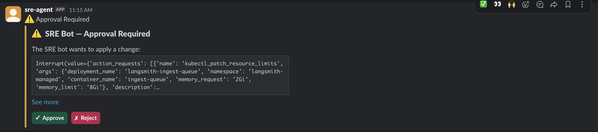

# SRE Bot

An autonomous Kubernetes SRE agent. It monitors cluster health, diagnoses issues, and applies fixes — with human approval required before any write operation.

## Features

- **Autonomous health audits** — pods, scaling, resources, logs, security, reliability, config hygiene, and batch jobs analyzed in parallel by specialized subagents
- **Human-in-the-loop (HITL)** — every write operation (restart, scale, patch) pauses for explicit approval
- **Slack integration** — alerts, health reports, and HITL approve/reject buttons via Socket Mode (no public ingress needed)
- **Scheduled monitoring** — periodic cluster health checks on a configurable interval
- **Two interfaces** — CLI for interactive use, FastAPI + web UI for in-cluster deployment
- **LangSmith tracing** — full observability of every agent run, with an eval dataset and online evaluators

## Example Output

Slack health report showing a cluster audit with critical and warning findings:




## Architecture

```text
main.py / api.py
    └── SRE orchestrator (agent.py)
            ├── pod-inspector        (read-only) — pod health, crashes, logs
            ├── scaling-analyzer     (read-only) — HPA, replicas, node capacity
            ├── performance-analyzer (read-only) — CPU/memory right-sizing
            ├── log-analyzer         (read-only) — error detection in logs
            ├── security-auditor     (read-only) — RBAC, privileged pods, NetworkPolicies, image tags
            ├── reliability-auditor  (read-only) — PDBs, probes, endpoints, single-replica SPOFs
            ├── job-inspector        (read-only) — Jobs, CronJobs, failures, missed schedules
            ├── config-auditor       (read-only) — resource limits, PV hygiene, selector mismatches
            └── change-executor      (write ops — all require HITL approval)
```

The main agent only has read tools. All writes are delegated to `change-executor`, which is configured to interrupt before every write tool call.

## Quick Start

### Prerequisites

- Python 3.12+
- `kubectl` configured and pointing at your cluster (for local dev)
- Anthropic API key
- LangSmith API key (for tracing)
- Slack app with Bot and App-level tokens (optional, for Slack notifications)

### Local dev

```bash
pip install -r requirements.txt
cp .env.example .env
# Fill in your keys in .env

python main.py        # CLI mode
python api.py         # API + web UI at http://localhost:8080
```

### Environment variables

| Variable | Required | Description |
| -------- | -------- | ----------- |
| `ANTHROPIC_API_KEY` | Yes | Claude API key |
| `LANGSMITH_API_KEY` | Yes | LangSmith tracing key |
| `LANGSMITH_PROJECT` | No | Project name (default: `sre-bot`) |
| `SLACK_BOT_TOKEN` | No | `xoxb-...` bot token |
| `SLACK_APP_TOKEN` | No | `xapp-...` Socket Mode token |
| `SLACK_CHANNEL` | No | Channel for alerts (default: `#sre-alerts`) |
| `MONITOR_INTERVAL_MINUTES` | No | Health check frequency (default: `30`) |
| `DEFAULT_NAMESPACES` | No | Comma-separated namespaces to watch (default: auto-discover) |
| `PROMETHEUS_URL` | No | Prometheus endpoint for richer metrics |
| `API_PORT` | No | Port for API server (default: `8080`) |

## Deploy to Kubernetes

The included `deploy.sh` handles build, ECR push, and EKS apply in one step:

```bash
./deploy.sh           # tags as :latest
./deploy.sh v1.2.0    # optional: tag with a version
```

Or manually:

```bash
# 1. Build and push your image
docker build --platform linux/amd64 -t your-registry/sre-agent:latest .
docker push your-registry/sre-agent:latest
# Update image in k8s/deployment.yaml

# 2. Create the secrets file (never commit this)
#   Each value must be base64-encoded:
echo -n "sk-ant-..." | base64   # ANTHROPIC_API_KEY
echo -n "lsv2_..."  | base64   # LANGSMITH_API_KEY
echo -n "xoxb-..."  | base64   # SLACK_BOT_TOKEN
echo -n "xapp-..."  | base64   # SLACK_APP_TOKEN
# Paste values into k8s/secret.yaml

# 3. Apply
kubectl apply -k k8s/

# 4. Access the UI
kubectl port-forward svc/sre-agent 8080:80 -n sre-agent
# Open http://localhost:8080
```

### RBAC

The included manifests grant:

- **Read** on all resources cluster-wide (`ClusterRole: sre-agent-reader`)
- **Write** (patch/update/delete) on all namespaces cluster-wide (`ClusterRole: sre-agent-writer`)

All write operations are still gated by HITL regardless of RBAC.

## Stopping the bot

| Mode | How to stop |
| ---- | ----------- |
| CLI (`main.py`) | `Ctrl+C` |
| API (`api.py`) | `Ctrl+C` or `kill <pid>` |
| In-cluster | `kubectl scale deployment sre-agent -n sre-agent --replicas=0` |
| Delete everything | `kubectl delete -k k8s/` |

## Project structure

```text
agent.py              Main SRE orchestrator
api.py                FastAPI server (SSE streaming, HITL endpoints, web UI)
main.py               CLI entry point
config.py             Env-based configuration
scheduler.py          Periodic health check scheduler
slack_notifier.py     Slack Block Kit messages and HITL action handling
deploy.sh             Build, push to ECR, and deploy to EKS
tools/
  kubernetes_read.py      Read-only kubectl tools
  kubernetes_write.py     Write tools (all require HITL approval)
  kubernetes_security.py  RBAC, pod security, NetworkPolicy, image tag tools
  kubernetes_reliability.py  PDB, probe, endpoint, single-replica tools
  kubernetes_hygiene.py   Resource limits, PV, selector mismatch tools
  kubernetes_batch.py     Job and CronJob tools
  k8s_client.py           In-cluster vs local kubectl detection
  slack.py                Slack notification tool for the agent
subagents/
  pod_inspector.py
  scaling_analyzer.py
  performance_analyzer.py
  log_analyzer.py
  security_auditor.py
  reliability_auditor.py
  job_inspector.py
  config_auditor.py
  change_executor.py      Only subagent with write tools
k8s/                  Kustomize manifests for cluster deployment
evals/                LangSmith evaluation dataset and online evaluators
```

## Security notes

- `k8s/secret.yaml` is in `.gitignore` — never commit it
- The container runs as a non-root user (`uid 1000`)
- If you suspect keys were exposed, rotate them immediately via the respective provider dashboards
