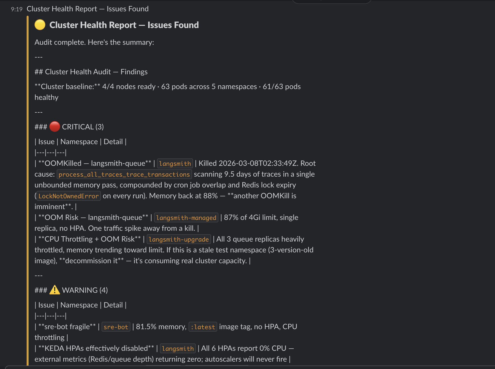

# SRE Bot

An autonomous Kubernetes SRE agent powered by Claude. It monitors cluster health, diagnoses issues, and applies fixes — with human approval required before any write operation.

## Features

- **Autonomous health audits** — pods, scaling, resource usage, and logs analyzed in parallel by specialized subagents
- **Human-in-the-loop (HITL)** — every write operation (restart, scale, patch) pauses for explicit approval
- **Slack integration** — alerts, health reports, and HITL approve/reject buttons via Socket Mode (no public ingress needed)
- **Scheduled monitoring** — periodic cluster health checks on a configurable interval
- **Two interfaces** — CLI for interactive use, FastAPI + web UI for in-cluster deployment
- **LangSmith tracing** — full observability of every agent run

## Example Output

Slack health report showing a cluster audit with critical and warning findings:



## Architecture

```text
main.py / api.py
    └── SRE orchestrator (agent.py)
            ├── pod-inspector       (read-only)
            ├── scaling-analyzer    (read-only)
            ├── performance-analyzer (read-only)
            ├── log-analyzer        (read-only)
            └── change-executor     (write ops — all require HITL approval)
```

The main agent only has read tools. All writes are delegated to `change-executor`, which is configured to interrupt before every write tool call.

## Quick Start

### Prerequisites

- Python 3.12+
- `kubectl` configured and pointing at your cluster (for local dev)
- Anthropic API key
- LangSmith API key (for tracing)
- Slack app with Bot and App-level tokens (optional, for Slack notifications)

### Local dev

```bash
pip install -r requirements.txt
cp .env.example .env
# Fill in your keys in .env

python main.py        # CLI mode
python api.py         # API + web UI at http://localhost:8080
```

### Environment variables

| Variable | Required | Description |
| -------- | -------- | ----------- |
| `ANTHROPIC_API_KEY` | Yes | Claude API key |
| `LANGSMITH_API_KEY` | Yes | LangSmith tracing key |
| `LANGSMITH_PROJECT` | No | Project name (default: `sre-bot`) |
| `SLACK_BOT_TOKEN` | No | `xoxb-...` bot token |
| `SLACK_APP_TOKEN` | No | `xapp-...` Socket Mode token |
| `SLACK_CHANNEL` | No | Channel for alerts (default: `#sre-alerts`) |
| `MONITOR_INTERVAL_MINUTES` | No | Health check frequency (default: `30`) |
| `DEFAULT_NAMESPACES` | No | Comma-separated namespaces to watch (default: auto-discover) |
| `PROMETHEUS_URL` | No | Prometheus endpoint for richer metrics |
| `API_PORT` | No | Port for API server (default: `8080`) |

## Deploy to Kubernetes

```bash
# 1. Build and push your image
docker build -t your-registry/sre-bot:latest .
docker push your-registry/sre-bot:latest
# Update image in k8s/deployment.yaml

# 2. Create the secrets file (never commit this)
cp k8s/secret.yaml.example k8s/secret.yaml   # or fill in manually
#   Each value must be base64-encoded:
echo -n "sk-ant-..." | base64   # ANTHROPIC_API_KEY
echo -n "lsv2_..."  | base64   # LANGSMITH_API_KEY
echo -n "xoxb-..."  | base64   # SLACK_BOT_TOKEN
echo -n "xapp-..."  | base64   # SLACK_APP_TOKEN

# 3. Apply
kubectl apply -k k8s/

# 4. Access the UI
kubectl port-forward svc/sre-bot 8080:80 -n sre-bot
# Open http://localhost:8080
```

### RBAC

The included ClusterRole grants:

- **Read** on all resources cluster-wide
- **Write** (patch/update) scoped to deployments, HPAs, pods, and nodes only

All write operations are still gated by HITL regardless of RBAC.

## Stopping the bot

| Mode | How to stop |
| ---- | ----------- |
| CLI (`main.py`) | `Ctrl+C` |
| API (`api.py`) | `Ctrl+C` or `kill <pid>` |
| In-cluster | `kubectl scale deployment sre-bot -n sre-bot --replicas=0` |
| Delete everything | `kubectl delete -k k8s/` |

## Project structure

```text
agent.py              Main SRE orchestrator
api.py                FastAPI server (SSE streaming, HITL endpoints, web UI)
main.py               CLI entry point
config.py             Env-based configuration
scheduler.py          Periodic health check scheduler
slack_notifier.py     Slack Block Kit messages and HITL action handling
tools/
  kubernetes_read.py  Read-only kubectl tools
  kubernetes_write.py Write tools (all require HITL approval)
  k8s_client.py       In-cluster vs local kubectl detection
  slack.py            Slack notification tool for the agent
  helm.py             Helm tools
subagents/
  pod_inspector.py
  scaling_analyzer.py
  performance_analyzer.py
  log_analyzer.py
  change_executor.py  Only subagent with write tools
k8s/                  Kustomize manifests for cluster deployment
evals/                LangSmith evaluation dataset creation
```

## Security notes

- `k8s/secret.yaml` is in `.gitignore` — never commit it
- The container runs as a non-root user (`uid 1000`)
- If you suspect keys were exposed, rotate them immediately via the respective provider dashboards
